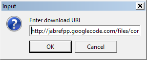
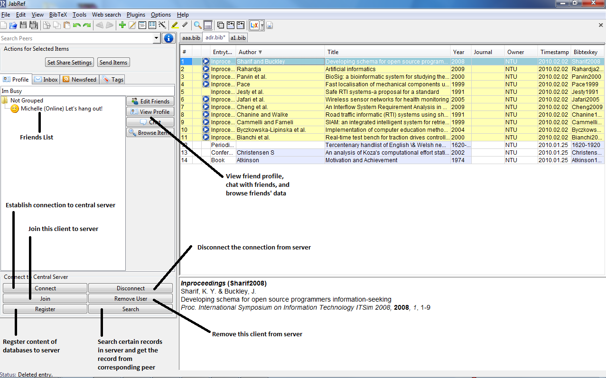
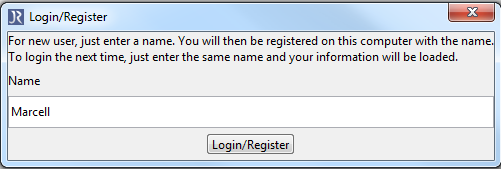

# SoJa (Social JabRef) 

> Peer-to-peer plug-in for social networked Jabref reference management

Scientific paper: [SoJa: Collaborative reference management using a decentralized social information system](https://doi.org/10.4108/icst.collaboratecom.2010.32).

## Requirements

  * [Jabref 2.5](http://sourceforge.net/projects/jabref/files/jabref/2.5/)
  * Both friends need to have the plugin installed to see each other
  * Server has to be setup and the code has to be run in order the program can establish connection to server
  * Client has to specify the address of server (ip address and port)

## Getting Started

### Installation

Run Jabref 2.5 and follow the 3 steps to install the plugin

1. **Plugins > Manage Plugins** 
   

2. Download Plugin 
   
   
   From the bottom options, choose "Download plugin". 
   
   **(Currently unavailable)**

3. Restart Jabref.
   Shutdown and reopen your Jabref and the plugin "Jabref p2p" should be in your plugin tab now. 
   

## Usage

1. Run the plugin with Plugins > Jabref p2p 
   

2. Enter a name
   Just enter a name your friends will recognize. After entering your name, there is a built-in user guide to help you with the various functions to using Jabref p2p. 
   

3. For first time log-in user. 
   A user guide will be shown and you can add friends using a friend finder or a manual invitation. 
   

4. Friend finder.
   By using Open DHT library, this can detect presence of potential friends in the network and add those friends subsequently. 
   
   
5. Invitation to join JabRefP2P.
   If friend finder is not able to find the desired peers, this manual invitation can be sent to them by utilizing the invitation code. 
   

6. Accepting Friend Request.
   Once request to add friend has been propagated to the corresponding peer, friend request window is displayed in the application. Peer has right to accept or reject the request. 
   

7. Instant Messaging.
   Instant messaging can be performed among online peers. 
   

8. Register database to server and replication
   Register database to server, store the database's records to server and replicate to some peers. 
   

9. Search and Get Records.
   You are allowed to specify up to four criteria to search certain records in the server. the server return the hits and you can choose which peer you can contact to download the record. 
   

## Limitations

* OpenLookup 20-byte limit for key so high chance of collision
* OpenLookup have no security to prevent someone from posting over your key
* OpenLookup can store data for only last a week the most
